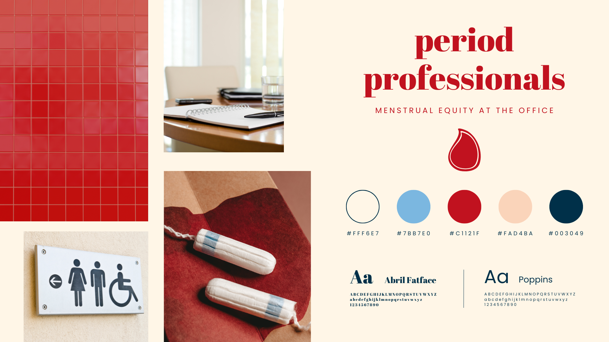

# Period Professionals

## Introduction 

Period Professionals is the result of my first Individual Project at the Code Institute's Full Stack Bootcamp. This project is a site that will give the user a basic understanding of menstrual equity in the workplace, through the lens of diversity and inclusion. Period Professionals is a glimpse into everything I have learnt over the first five weeks of the Bootcamp using HTML/CSS/Bootstrap, combined with my love for fun branding.

<a href="https://katee145.github.io/periodprofessionals/" target="_blank">View the live project here.</a>

## UX Design

#### Site Owner’s Goal
The site owner aims to create a visually appealing, easy-to-navigate webpage that introduces diversity and inclusion concepts and offers basic guidance on how to implement these practices. The focus is on clear communication through effective use of HTML and CSS, utilising Bootstrap for layout and design.

### User Stories

The user stories for this project as well as their acceptance criteria and tasks can be found in the <a href="https://katee145.github.io/periodprofessionals/](https://github.com/users/katee145/projects/8/views/1)" target="_blank">project board</a>.

* As a first-time visitor, I want an introductory section about menstrual equity so that I understand why it matters.
* As a business owner, I want to understand how periods can impact my employees so that I can make the workplace better for them.
* As someone who works in HR, I want a list of external resources so that I can further explore menstrual equity topics.
* As a visitor, I want clear navigation so that I can easily find sections relevant to me.
* As someone who menstruates, I want to know how to approach my work so that I can have my needs met at the office.
* As a potential client, I want access to contact information so that I can reach out for more details or support.
* As a potential supporter, I want to read testimonials so that I can see the impact of menstrual equity practices in the workplace.

### Wireframes

The wireframes for this project were created using Canva to map out the structure of the site on both mobile and desktop view. Doing so helped to guide the development of the site and how the flow of information would best suit the user.
#### Mobile

#### Desktop

### Branding

#### Fonts

This project used Abril Fatface as the heading font and Poppins as the body font. Both of these are available via Google Fonts.

#### Colour Palette

The colour palette for Period Professionals aimed to be bold yet still professional given that it concerns a workplace environment. Above all the palette needed to be accessible in its colour contrast. Some of the colours were never paired together because they would not be accessible nor visually appealing, for example, the dark red with either the light or dark blue.

#### Imagery

All imagery for Period Professionals came from Canva. This includes the photo section and the graphics section. The photos were chosen to compliment the colour palette whilst staying on theme to the topic. The graphics were used as icons relevant to each card in the tip section. The graphics were also chosen to look visually similar and be edited to fit with the project's colour palette.

### Responsiveness

Period Professionals is a site that is responsive across all device sizes. The layout is adjusted to suit each screen sizes using Bootstrap's grid system. To ensure a better user experience on mobile I also removed an image for those using a smaller screen size as it made scrolling unnecessarily long.

## Features
### Existing Features
#### Navigation bar
The navigation bar is fixed to the top of the site, meaning it is always viewable to the user wherever they are on the webpage. It includes the Period Professionals logo on the left and the links to the Home, About, Tips, Testimonials, and Contact sections on the right. The Tips link acts as a dropdown menu where the user can choose either the employers or employees section. On smaller screen sizes the navigation bar items condense into a drop-down menu to better fit the content whilst still being findable to the user.

#### Hero image

The hero image is the landing page for users on any screen size. It displays the site's title and subheading on top of an image of bathroom tiles to complement the menstrual equity subject. The image is edited so that the text is still readable and it is visually appealing. The hero image is consciously made to leave the next section in view so that users are more likely to scroll further down the page.

#### Basic information

The basic information section provides important context about the website and why menstrual equity is important in the workplace. This section means that any user can come to the site and understand its purpose even without any prior knowledge. The text is kept short to not overload any information and is broken up by relevant images.

#### Tips

The tips section of the site is broken into two. The first section is for employers since they are the primary target audience, then the second is for employees as a secondary target audience. These sections can also be reached from the navigation bar so that the user can select which is relevant to them. Each section has four cards each with an icon, advisory information, and a link to an external resource to learn more.

#### Testimonials

The testimonials section displays a carousel of quotes from both employers and employees vouching for menstrual equity in the workplace. Each slide has a headshot, a quote, and a name and title. The carousel autoplays at an appropriate pace but the user can also manually press the buttons to change the slide.

#### Contact

The contact section includes a form for the user's name, phone number, email address, and message. Each field of the form is required so that all necessary information is there when it is submitted. This form means the user can contact Period Professionals for any queries.

#### Footer

The footer is a simple section that is stuck to the bottom of the site and only visible when the user reaches the end of the page. It displays social media icons so that the user can find out more about Period Professionals. Since Period Professionals is not a real organisation, the links take you to the homepage of each social media. 

### Future Changes

* The UX of the contact form would improve if there was a 'success' page to acknowledge that the form was submitted.
* The navigation bar does not close on small screen sizes after a link is clicked. This is due to it being a Bootstrap feature but it is something that would improve UX.
* The testimonial section would benefit from controls that show the user how to pause on a slide.
* The employer tips and employee tips would benefit from each having their own separate page since they include a lot of information. In this case, the homepage would be a much shorter section that would link to them with a button that asks where the user is an employer or employee.
* If Period Professionals were an operating business, the site would benefit from having calls to action dotted throughout the site to get in contact and a phone number to better suit the user's needs.
* The headings of each card use H5 which was flagged as a warning during the Lighthouse accessibility check. With more time I would create a custom class so that visually they appear the same but the accessibility score would be 100.

## Testing

To ensure the success of the site there was testing and debugging carried out throughout the process. This meant that the site is now successfully deployed and has passed testing.

### Validator Testing
No errors in HTML

No errors with CSS

### Lighthouse
All categories 90-100 in Lighthouse

## Deployment

The site was deployed to GitHub pages. The steps to deploy are as follows:
* Go to the Settings tab of your GitHub repo.
* On the left-hand sidebar, in the Code and automation section, select Pages.
* Make sure the source is set to 'Deploy from Branch'.
* Make sure the main branch is selected.
* Make sure the folder is set to / (root).
* Under Branch, click Save.
* Go back to the Code tab and wait a few minutes before refreshing.
* On the right-hand side in the Deployments section click on 'github-pages'.
* The latest deployed link will appear at the top of the page.

<a href="https://katee145.github.io/periodprofessionals/" target="_blank">View the live project here.</a>

## Credits
### Code
* The initial GitHub project was built using the Code Institute template to start.
* The navigation bar and tips cards were built with Bootstrap features.
* The testimonial section layout was built using AI.
* The footer replicated Code Institute's Love Running project.
* The contact form replicated Code Institute's Boardwalk project.
* AI was used to assist with debugging.

### Content
* The text content was generated using AI.
* The icons in the footer were from Font Awesome.

### Media
* All imagery was from Canva.
