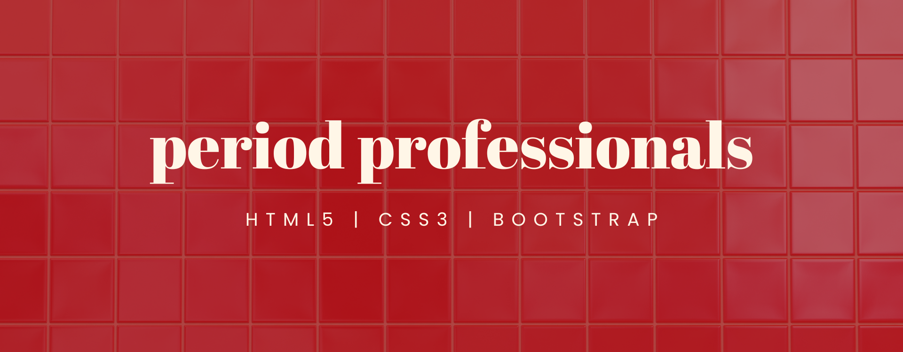

# Period Professionals

## Introduction 

Period Professionals is the result of my first Individual Project at the Code Institute's Full Stack Bootcamp. The project gives the user a basic understanding of menstrual equity in the workplace, through the lens of diversity and inclusion as outlined in the project's brief. Period Professionals is a glimpse into everything I have learnt over the first five weeks of the Bootcamp using HTML/CSS/Bootstrap, combined with my love for bold branding and bold ideas.

<a href="https://katee145.github.io/periodprofessionals/" target="_blank">View the live project.</a>

## UX Design

Site Owner’s Goal:
The site owner aims to create a visually appealing, easy-to-navigate webpage that introduces diversity and inclusion concepts and offers basic guidance on how to implement these practices. The focus is on clear communication through effective use of HTML and CSS, utilising Bootstrap for layout and design.

[computer/phone image]

### User Stories

* As a first-time visitor, I want an introductory section about menstrual equity so that I understand why it matters.
* As a business owner, I want to understand how periods can impact my employees so that I can make the workplace better for them.
* As someone who works in HR, I want a list of external resources so that I can further explore menstrual equity topics.
* As a visitor, I want clear navigation so that I can easily find sections relevant to me.
* As someone who menstruates, I want to know how to approach my work so that I can have my needs met at the office.
* As a potential client, I want access to contact information so that I can reach out for more details or support.
* As a potential supporter, I want to read testimonials so that I can see the impact of menstrual equity practices in the workplace.

### Wireframes

### Branding

#### Fonts

#### Colour palette

#### Imagery

### Responsiveness

## Features
intro

### Existing Features
####Navigation bar
*

#### Hero image
*

#### Basic information
*

#### Tips
*

#### Testimonials
*

#### Contact
*

#### Footer
*

### Features to Implement
outro

## Testing

intro

### Validator Testing
*

### Lighthouse
*

### Unfixed Bugs
*Navbar

## Deployment

## Credits
### Content
*

### Media
*

<a href="https://katee145.github.io/periodprofessionals/" target="_blank">View the live project.</a>
